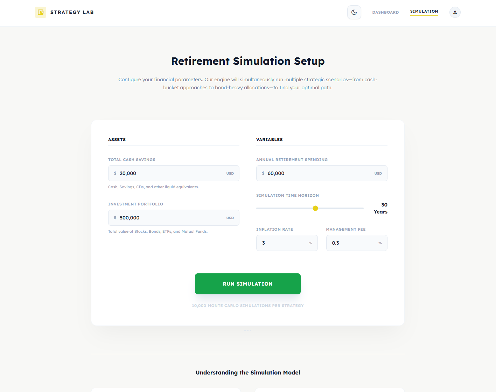
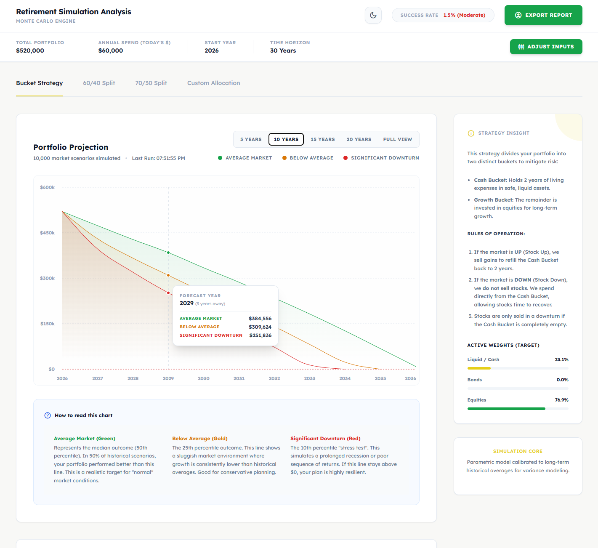
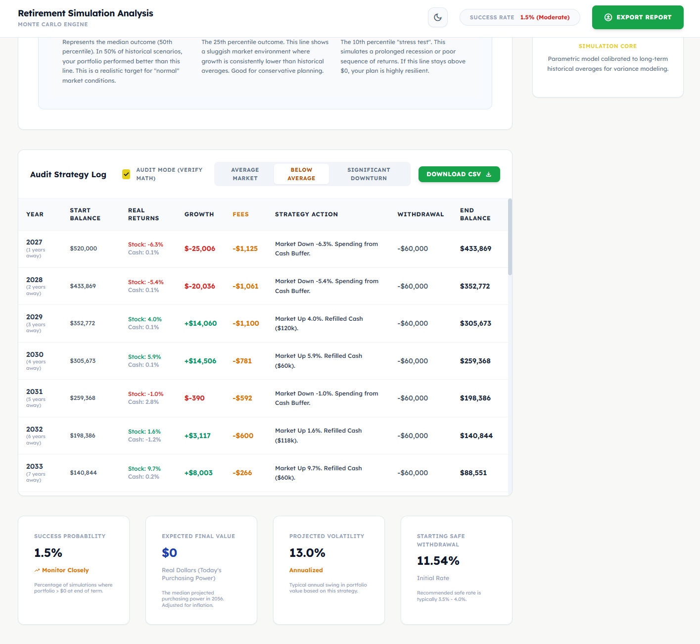
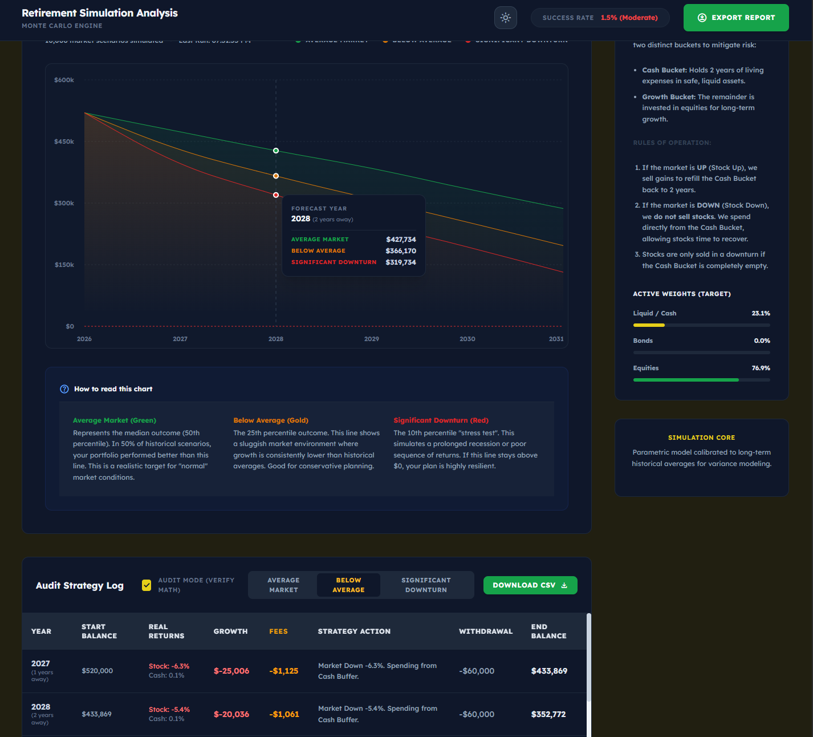

  

# Retirement Simulation Analysis

Retirement Simulation Analysis is an interactive web application designed to help you project your financial future using advanced Monte Carlo simulations. By modeling various investment strategies and market conditions, it offers insights into your portfolio's survivability and expected value over your chosen retirement time horizon.

## Features at a Glance

  
  
  

## How the Algorithm Works

The core of the application relies on a parametric Monte Carlo Engine calibrated to long-term historical market averages, variance, and inflation expectations. 

For each simulation run (typically 10,000 scenarios per configuration):
1. **Asset Class Modeling**: The simulation models discrete asset classes (Cash, Bonds, Equities) with their own expected returns and volatility profiles.
2. **Path Generation**: It generates random return paths year-over-year, accounting for sequences of returns (the order in which positive or negative returns occur).
3. **Strategy Application**: Every simulated year, the engine applies the rules of the selected withdrawal strategy. For instance, the **Bucket Strategy** will try to refill the cash bucket in positive years and draw exclusively from cash in negative ones to spare equity from being sold while down. Fixed allocation strategies (e.g., **60/40 Split**) will automatically rebalance the portfolio annually to maintain the target weights.
4. **Percentile Extraction**: After generating 10,000 unique paths, the algorithm sorts the final outcomes and extracts specific percentiles:
   - **Average Market (50th Percentile):** The median outcome.
   - **Below Average (25th Percentile):** A sluggish market environment.
   - **Significant Downturn (10th Percentile):** A stress-tested scenario simulating prolonged recessions.

## How the Simulation Works

1. **Input Parameters:** You start by defining your current financial picture: Initial Cash, Initial Investments, Annual Spend (in today's dollars), and your Retirement Time Horizon.
2. **Run Analysis:** The application runs the simulations in your browser and instantly charts the projected purchasing power of your portfolio over time. 
3. **Compare Strategies:** You can quickly toggle between different investment strategies (Bucket, Conservative, Aggressive, Custom Allocation) to see how the mathematical rules of each approach impact your portfolio's longevity.
4. **Audit Mode:** To ensure transparency, you can toggle "Audit Mode." This breaks down the simulation year-by-year for exactly one of the percentile scenarios, showing you exactly how much growth occurred, fees extracted, the exact strategy action taken, withdrawal amounts, and the ending balance.

## Run Locally

**Prerequisites:**  Node.js

1. Install dependencies:
   `npm install`
2. Run the app:
   `npm run dev`
